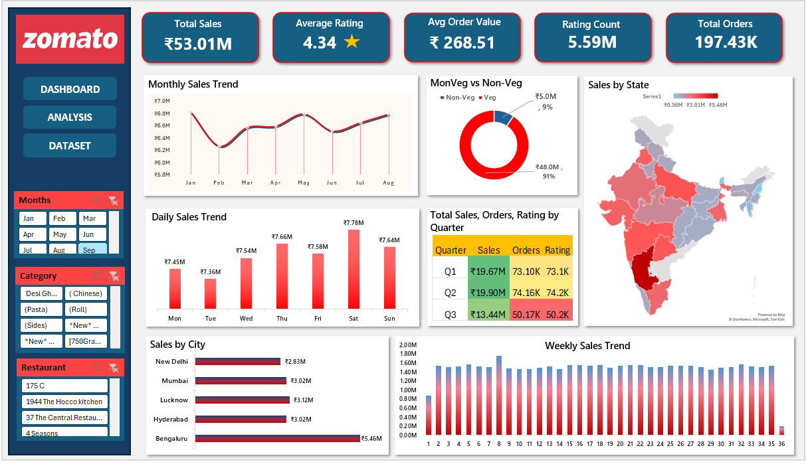

<h1 align="center">🍽️ Zomato Sales & Customer Analytics Case Study</h1>

End-to-end food delivery analytics product analyzing customer behavior, revenue trends, and restaurant performance.

<h2>📌 Problem Statement</h2>

Food delivery platforms generate large volumes of order and rating data, but businesses often struggle to understand 
customer preferences, city-level demand, and revenue drivers.  
This project analyzes Zomato order data to identify:

<ul>
<li>Revenue drivers and top performing cities</li>
<li>Customer demand patterns (weekday vs weekend)</li>
<li>Cuisine and category performance</li>
<li>Restaurant rating impact on sales</li>
<li>Seasonality and quarterly growth trends</li>
</ul>

<h2>📊 Project Overview</h2>

This project performs <b>end-to-end sales and customer analytics</b> on Zomato order data.  
Performed <b>EDA, data cleaning, and feature engineering in Python</b> on 
<b>197K+ food orders</b> and <b>5.59M ratings</b>, followed by building an 
<b>interactive Excel dashboard</b> for business insights.

Engineered features including monthly trends, weekday vs weekend demand, cuisine segmentation, 
and quarterly KPIs before visualization.

<h2>📈 Key Metrics</h2>

<ul>
<li><b>Total Sales:</b> ₹53.01M</li>
<li><b>Total Orders:</b> 197K</li>
<li><b>Average Order Value:</b> ₹268.51</li>
<li><b>Average Rating:</b> 4.34</li>
<li><b>Total Ratings:</b> 5.59M</li>
</ul>

<h2>📊 Dashboard Preview</h2>

<h2>🔍 Key Business Insights</h2>

<ul>
<li>Non-Veg orders contributed <b>~91% of revenue (₹48M+)</b></li>
<li>Top 5 cities generated <b>~42% of total sales</b></li>
<li>Bengaluru led with <b>~₹5.46M revenue</b></li>
<li>Weekend orders increased <b>~14%</b></li>
<li>Saturday recorded peak revenue <b>~₹7.78M</b></li>
<li>Q2 recorded highest quarterly sales <b>~₹19.9M</b></li>
<li>Restaurants rated <b>>4.2 generated ~31% higher sales</b></li>
</ul>

<h2>📊 Dashboard Features</h2>

<ul>
<li>KPI tracking (Sales, Orders, AOV, Ratings)</li>
<li>Monthly sales trend analysis</li>
<li>Weekday vs Weekend demand analysis</li>
<li>Veg vs Non-Veg revenue comparison</li>
<li>City level performance analysis</li>
<li>Restaurant rating vs revenue analysis</li>
<li>Quarterly sales performance</li>
<li>State-wise sales map</li>
<li>Interactive filters</li>
</ul>

<h2>🛠 Tools & Technologies</h2>

<ul>
<li>Python — Data cleaning & preprocessing</li>
<li>Pandas — Data manipulation</li>
<li>NumPy — Numerical analysis</li>
<li>Matplotlib — Data visualization</li>
<li>Seaborn — Statistical visualization</li>
<li>Excel — Dashboard creation</li>
<li>Feature Engineering — KPI creation</li>
<li>EDA — Exploratory Data Analysis</li>
</ul>

<h2>📂 Project Workflow</h2>

<ol>
<li>Data collection and loading</li>
<li>Data cleaning and preprocessing</li>
<li>Handling missing values</li>
<li>Feature engineering</li>
<li>Exploratory data analysis</li>
<li>Business KPI creation</li>
<li>Visualization using Python</li>
<li>Excel dashboard development</li>
<li>Insight generation</li>
</ol>

<h2>📁 Project Structure</h2>

<h2>🎯 Business Value</h2>

This analytics product helps food delivery platforms:

<ul>
<li>Identify high revenue cities</li>
<li>Understand customer food preferences</li>
<li>Optimize weekend operations</li>
<li>Improve restaurant selection strategy</li>
<li>Increase average order value</li>
<li>Track seasonal demand trends</li>
</ul>

<h2>👨‍💻 Author</h2>

<b>Kuldeep Rathore</b>

  

🔗 LinkedIn  
<a href="https://www.linkedin.com/in/kuldeeprathore9440">
linkedin.com/in/kuldeeprathore9440
</a>

⭐ If you like this project, give it a star!

